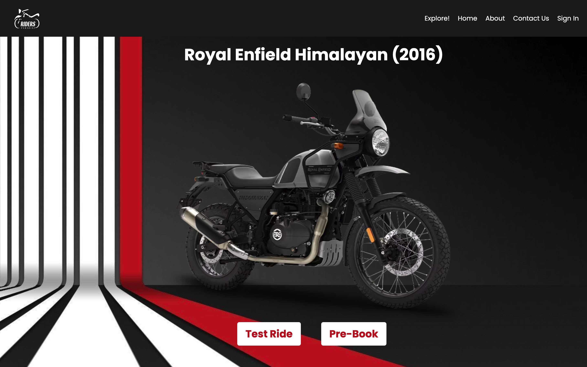

#  🏍️ **Riders Paradise: Your Motorcycle Haven** 🏍️ 


## ~ **Screenshots** ~





Welcome to "Riders Paradise" – where the thrill of the open road meets cutting-edge technology. 🛣️

🚀 Get ready to embark on an epic journey through the world of motorcycles. Whether you're a passionate rider, an enthusiast, or just curious about the two-wheeled lifestyle, our project has something for everyone.

🔥 **Key Features:**

🏁 Explore our extensive bike showroom with a user-friendly interface.
📦 Easily manage your bike inventory with a robust backend powered by the MERN stack.
🛒 Shop for the bike of your dreams with a seamless cart and checkout experience.
💬 Connect with fellow riders and our friendly staff through a built-in messaging system.
📊 Gain insights into your bike sales and customer interactions with advanced analytics.

📢 Join the "Bikers Paradise" community and experience the road like never before. Let's ride! 🏴‍☠️


## Tech Stack

**Client:** React

**Server:** Node, Express, MongoDB


## Run Locally

Clone the project

```bash
  git clone all3n2601/Riders-Paradise
```

Go to the project directory

```bash
  cd riders_paradise
```

Install dependencies

```bash
  npm install
```

Start the server

```bash
  npm start
```


## Screenshots


## Feedback

If you have any feedback, please reach out to any of the collabarators


## Support

For support, email allenabi2614@gmail.com 
